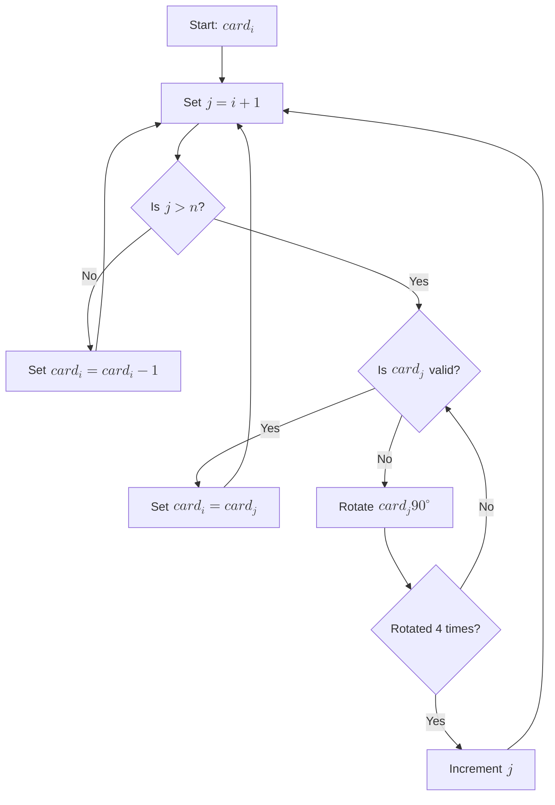

For a block that is valid from previous block

```mermaid
flowchart TD
    A[Start: $$\ card_i$$] --> B[Set $$\ j = i + 1$$]
    B --> C{Is $$\ j > n$$?}
    
    C -- No --> D[Set $$\ card_i = card_i-1$$]
    D --> B
    
    C -- Yes --> E{Is $$\ card_j\ $$ valid?}
    
    E -- Yes --> F[Set $$\ card_i = card_j$$]
    F --> B
    
    E -- No --> G[Rotate $$\ card_j 90^\circ$$]
    G --> H{Rotated 4 times?}
    
    H -- No --> E
    H -- Yes --> I[Increment $$\ j$$]
    I --> B
```